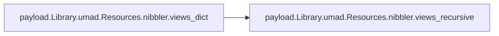

# Payload Library

[_Documentation generated by Documatic_](https://www.documatic.com)

<!---Documatic-section-Codebase Structure-start--->
## Codebase Structure

<!---Documatic-block-system_architecture-start--->
```mermaid
None
```
<!---Documatic-block-system_architecture-end--->

# #
<!---Documatic-section-Codebase Structure-end--->

<!---Documatic-section-payload.Library.umad.Resources.nibbler.views_recursive-start--->
## payload.Library.umad.Resources.nibbler.views_recursive

<!---Documatic-section-views_recursive-start--->
<!---Documatic-block-payload.Library.umad.Resources.nibbler.views_recursive-start--->
<details>
	<summary><code>payload.Library.umad.Resources.nibbler.views_recursive</code> code snippet</summary>

```python
def views_recursive(view_obj):
    yield view_obj
    for x in view_obj.subviews():
        for y in views_recursive(x):
            yield y
```
</details>
<!---Documatic-block-payload.Library.umad.Resources.nibbler.views_recursive-end--->
<!---Documatic-section-views_recursive-end--->

# #
<!---Documatic-section-payload.Library.umad.Resources.nibbler.views_recursive-end--->

<!---Documatic-section-payload.Library.umad.Resources.nibbler.views_dict-start--->
## payload.Library.umad.Resources.nibbler.views_dict

<!---Documatic-section-views_dict-start--->


### Object Calls

* payload.Library.umad.Resources.nibbler.views_recursive

<!---Documatic-block-payload.Library.umad.Resources.nibbler.views_dict-start--->
<details>
	<summary><code>payload.Library.umad.Resources.nibbler.views_dict</code> code snippet</summary>

```python
def views_dict(nib_obj):
    all_windows = [x for x in nib_obj if x.className() == 'NSWindow']
    win = all_windows[0]
    top_view = win.contentView()
    v_dict = dict()
    for v in views_recursive(top_view):
        ident = v.identifier()
        if ident is not None:
            if not ident.startswith('_'):
                v_dict[ident] = v
    return v_dict
```
</details>
<!---Documatic-block-payload.Library.umad.Resources.nibbler.views_dict-end--->
<!---Documatic-section-views_dict-end--->

# #
<!---Documatic-section-payload.Library.umad.Resources.nibbler.views_dict-end--->

<!---Documatic-section-payload.Library.umad.Resources.nibbler.quit_app-start--->
## payload.Library.umad.Resources.nibbler.quit_app

<!---Documatic-section-quit_app-start--->
<!---Documatic-block-payload.Library.umad.Resources.nibbler.quit_app-start--->
<details>
	<summary><code>payload.Library.umad.Resources.nibbler.quit_app</code> code snippet</summary>

```python
def quit_app():
    NSApplication.sharedApplication().terminate_(None)
```
</details>
<!---Documatic-block-payload.Library.umad.Resources.nibbler.quit_app-end--->
<!---Documatic-section-quit_app-end--->

# #
<!---Documatic-section-payload.Library.umad.Resources.nibbler.quit_app-end--->

<!---Documatic-section-payload.Library.umad.Resources.nibbler.func_to_controller_selector-start--->
## payload.Library.umad.Resources.nibbler.func_to_controller_selector

<!---Documatic-section-func_to_controller_selector-start--->
<!---Documatic-block-payload.Library.umad.Resources.nibbler.func_to_controller_selector-start--->
<details>
	<summary><code>payload.Library.umad.Resources.nibbler.func_to_controller_selector</code> code snippet</summary>

```python
def func_to_controller_selector(f_obj):
    o = genericController.alloc().init()
    o.setTheThing_(f_obj)
    return o
```
</details>
<!---Documatic-block-payload.Library.umad.Resources.nibbler.func_to_controller_selector-end--->
<!---Documatic-section-func_to_controller_selector-end--->

# #
<!---Documatic-section-payload.Library.umad.Resources.nibbler.func_to_controller_selector-end--->

[_Documentation generated by Documatic_](https://www.documatic.com)